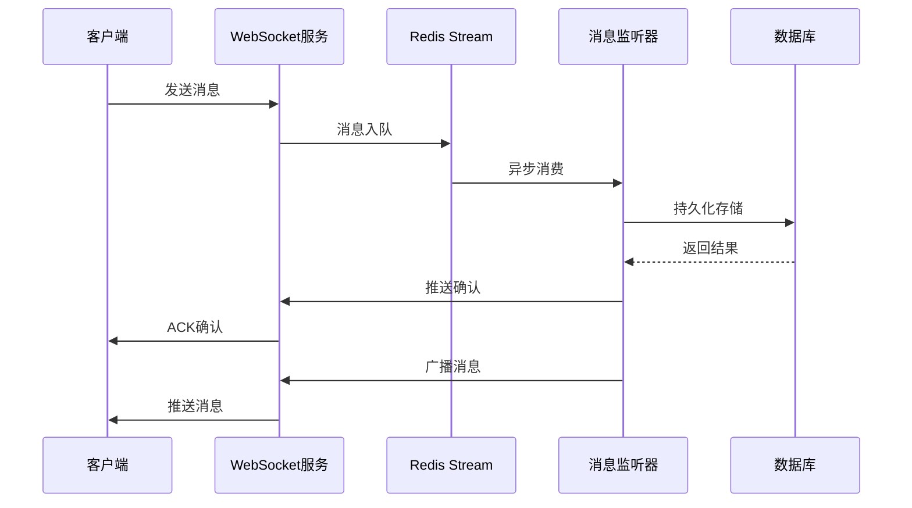

# devSphere-chat - 高性能实时聊天服务

<div align="center">

[](#)
[](#)
[](#)
[](#)

</div>

## 🌟 项目亮点

devSphere-chat 是一个基于 Spring Boot 构建的企业级实时聊天服务，专为高并发、低延迟的即时通讯场景设计。它不仅提供了完整的私聊和群聊功能，还通过创新的技术架构确保了消息的可靠传输和系统的稳定性。

### 🚀 核心优势

- **高并发支持**: 基于 Netty 的异步事件驱动模型，轻松应对万级并发连接
- **消息可靠性**: Redis Stream 消息队列 + 死信队列机制，确保消息零丢失
- **架构先进**: 事件驱动 + 异步处理模式，提升系统整体性能
- **扩展性强**: 模块化设计，易于定制和二次开发

## 💬 聊天服务详解

### 📱 功能特性

#### 基础聊天功能
- **私聊(P2P)**: 用户之间一对一实时消息传递
- **群聊(Room)**: 支持多人同时在线聊天
- **多消息类型**: 文本、图片、语音、视频、文件等多种消息格式
- **离线消息**: 自动存储和推送用户离线期间的消息
- **消息状态**: 已读/未读标记、消息撤回等状态管理

#### 社交功能
- **好友管理**: 添加、删除、备注好友关系
- **群组管理**: 创建、解散群组，成员管理
- **会话列表**: 实时展示私聊和群聊会话列表
- **消息通知**: 系统通知、好友申请、群聊邀请等提醒

### 🏗️ 技术架构

```text
┌─────────────────┐    ┌─────────────────┐    ┌─────────────────┐
│   WebSocket     │    │   HTTP API      │    │   定时任务      │
│   (Netty)       │    │   (Spring MVC)  │    │   (Scheduler)   │
└────────┬────────┘    └────────┬────────┘    └────────┬────────┘
         │                      │                      │
         └──────────────────────┼──────────────────────┘
                                │
                     ┌─────────▼─────────┐
                     │  业务逻辑层        │
                     │  (Service Layer)  │
                     └─────────┬─────────┘
                               │
          ┌────────────────────┼────────────────────┐
          │                    │                    │
┌─────────▼─────────┐ ┌────────▼────────┐ ┌─────────▼─────────┐
│   MySQL数据库      │ │   Redis缓存      │ │   Feign远程调用    │
│  (持久化存储)      │ │  (消息队列)      │ │  (用户服务)        │
└───────────────────┘ └─────────────────┘ └───────────────────┘
```


### 🔧 核心组件解析

#### 消息处理引擎
系统采用事件驱动架构处理各类消息：
- [`PrivateMessageListener`]: 私聊消息监听器，负责处理点对点消息的持久化
- [`GroupMessageListener`]: 群聊消息监听器，处理群组内消息广播
- [`MessageStreamListener`]: Redis Stream 消息监听器，消费消息队列中的数据

#### 消息传输保障
为了确保消息的可靠传输，系统实现了完整的消息生命周期管理：

1. **消息入队**: 通过 Redis Stream 将消息放入队列
2. **异步处理**: 监听器异步消费队列消息并持久化到数据库
3. **异常处理**: 异常消息自动进入死信队列等待人工处理
4. **状态同步**: 实时更新消息状态和用户会话信息

#### WebSocket 通信层
基于 Netty 构建的高性能 WebSocket 服务器：

- [`NettyServer`]: WebSocket 服务器启动配置
- [`WebSocketServerHandler`]: WebSocket 连接处理器
- [`AuthHandler`]: 连接认证处理器

### 📦 数据模型设计

系统采用清晰的数据模型来管理聊天相关信息：

- [`Message`]: 消息实体，存储所有聊天内容
- [`Room`]: 房间实体，表示聊天会话
- [`RoomFriend`]: 私聊房间关联
- [`RoomGroup`]: 群聊房间详情
- [`UserRoomRelate`]: 用户与房间的关系

### 🔄 消息流转流程




## 🛠️ 部署要求

- Java 17+
- MySQL 8.0+
- Redis 6.0+
- Maven 3.6+
- Nacos Server 2.x

## 🚀 快速开始

1. 克隆项目代码
2. 配置数据库和 Redis 连接信息
3. 启动 Nacos 服务注册中心
4. 运行应用启动类
5. WebSocket 服务默认监听 9000 端口

## 📄 许可证

Apache License Version 2.0

---

**devSphere-chat** - 构建下一代企业级实时通信解决方案